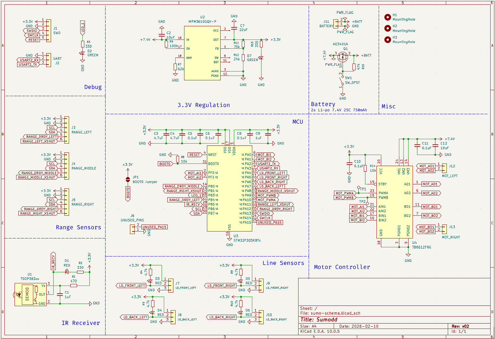
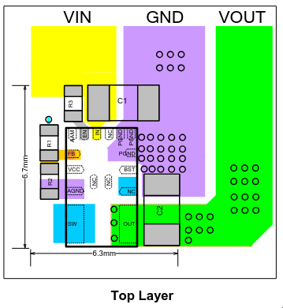

# Sumodd motherboard PCB schematic and layout

This repository holds the schematic and PCB layout files for the
[Sumodd](https://github.com/oddgrd/sumodd) mini-sumo robot motherboard, as well as documentation
for the layout of the various components.

When a new iteration of the PCB is manufactured, the latest included commit is tagged with a
version number, e.g. `v0.2`.

## PCB stackup

The board has four copper layers, with a total thickness of 1.6mm.

1. F.Cu — components, signal traces and power traces
2. In1.Cu — GND plane
3. In2.Cu — 3.3V power plane
4. B.Cu — signal routing overflow

## Power

The PCB is powered by a 2s 7.4V, 25C, 800 mAh LIPO battery. This voltage is fed to a MOSFET
transistor source, the gate of which is controlled by a SPST switch that connects the gate to 
ground when closed, and a pullup resistor that connects the gate to source when opened. The
transistor drain feeds a 7.4V power rail on the top layer, which connects directly to the motor
driver VM input. However, the MCU and other components want a stable 3.3V, so we use a
MPM3610AGQV-P buck converter configured to step down the battery input voltage, to feed the 3.3V
power plane on the third layer.

### MPM3610 Synchronous Step-Down Converter

Datasheet: https://cdn-learn.adafruit.com/assets/assets/000/127/631/original/MPM3610GQV-Z.pdf?1707519066

The MPM3610 is implemented as documented in the typical applications sections of the datasheet,
figure 12, to arrive at an output of 3.3V, while following the PCB layout guidelines in figure 10
(screenshot below).

- The EN (enable) pin is connected to IN (VIN) with a 100k resistor, to pull EN high when the device is
powered.
- There is a 10 uF input capacitor on the IN (VIN) pin. The converter switches its internal mosfets
on and off at 2MHz to regulate the output voltage. The capacitor, which should be placed right next
to the device, provides a low impedance local source for the high-frequency current demands of the
converter, rather than requiring the distant battery to supply it.
    - Note: a low-ESR ceramic capacitor with X5R or X7R dielectrics is recommended in the data sheet,
    and it should be placed as close to the IC as possible. It should have an RMS current rating
    greater than half of the maximum load current. Since the regulator will only supply the MCU,
    the sensors and some LEDs, it will have a low maximum load current, around 100mA.
- There is another decoupling 22uF capacitor on the output, to stabilize the DC output voltage,
providing transient current when the load suddenly changes. Ceramic, tantalum or low ESR electrolytic
capacitors are recommended, to keep the output-voltage ripple low.
- The FB pin (feedback) is connected to the tap of a resistor divider from the output to GND,
which is used to control the output voltage. The regulator adjusts the duty cycle to keep voltage
at the FB pin at the internal reference voltage (Vref), 0.798V. Since we want 3.3V, we need a
divider which leads to 0.8V at the tap when output is 3.3V. We use a 75k and a 24k resistor:
`VOUT = 0.8 × (1 + 75k/24k) ≈ 3.3V`. This matches the recommended values from the datasheet.
    - Note: the resistor divider should be placed as close to FB as possible, any noise on the
    trace can lead to incorrect adjustment of output voltage. Vias should not be placed on the
    FB traces.
- The AAM pin is pulled to GND through a 62k resistor, as recommended in the datasheet for 8V
input, which puts the MPM3610 into power-save mode. In this mode it switches at a lower frequency
during periods of low load, relying on the output capacitor to fill in the gaps, but during periods
of high load it will transition to CCM (continuous conduction mode) and switch at max frequency.
Read more about the modes in the datasheet, page 13.
- A LED with a 4.7k series resistor is connected from OUT to GND, lighting when the converter is
powered and supplying the 3.3V output.

Note: the PGND, IN and OUT paths should have short, direct and wide traces.

## Microcontroller

### STM32F303K8T6

Hardware development documentation (AN4206):
https://www.st.com/resource/en/application_note/an4206-getting-started-with-stm32f3-series-hardware-development-stmicroelectronics.pdf

Datasheet: https://www.st.com/resource/en/datasheet/stm32f303c6.pdf

The microcontroller takes its power from the 3.3V rail, supplied by the voltage regulator. It
reads all the sensors, and controls the motors via the motor controllers.

The hardware development documentation recommends:
- A multilayer PCB with a separate layer dedicated to ground, and another layer detected to supply
(VDD), to provide good decoupling and a good shielding effect.
- The PCB layout should have separate circuits for:
    - High-current circuits
    - Low-voltage circuits
    - Digital component circuits
    - Circuits separated according to their EMI contribution. This will reduce cross-coupling
    on the PCB that introduces noise
- Unused I/O, clocks or counters should not be left free, they should be pulled high or low. This
can be done through software by configuring the pins as GPIO output.

NOTE: for more detail, see the hardware development documentation section 5, where it also
elaborates on which decoupling capacitors should be used and where.

For support components, we don't use an external oscillator, so we just need decoupling capacitors.
- For both VDD/VSS pairs, we have 4.7uF (X5R, 10V) and 0.1uF (X7R, 10V) ceramic 0805 decoupling capacitors.
    - NOTE: these should be placed as close as possible to the VDD/VSS pairs, with the smaller one
    right between them. See example of this in the AN4206 doc, section 5.4.
- For VDDA, we have 0.1uF (X7R, 10V) and 1uF (X5R, 10V)  ceramic 0805 decoupling capacitors, placed
as close to the VDDA as possible,between VDDA and nearest VSS.

On this MCU, the BOOT0 pin should not float, and to boot from flash you need to pull the BOOT0 pin low.
Therefore, we pull it low with a 10k resistor by default, but we also add an open 2 pad solder jumper,
so that we can bridge BOOT0 to 3v3 if we need to boot with a bootloader. For more details on that, see
section 3 of AN4206.

## Motor Driver

https://www.ti.com/lit/ds/symlink/drv8212.pdf

The PCB has two DRV8212DSG motor drivers, controlling one motor each bidirectionally, using the
outputs as a full-bridge. The DSG package for this driver supports either a PWM interface or a
PH/EN interface.

The PWM interface requires two PWM inputs, one to each input pin, where one will
be disabled, or 0% duty cycle, and the others duty cycle will determine the speed. Flip this to
change direction.

The PH/EN interface, however, only requires one PWM input, to the first input pin, IN1. Then, the
second input pin is used to control direction. Two microcontroller pins are still needed, but the
pins can be choosen more freely, as only one needs to be PWM capable.

For this application, the PH/EN interface will be used, which is enabled by pulling the MODE pin
high on startup. This is achieved with a pullup on the MODE pin. See datasheet section 8.3.2.2
for more details, including a control truth table, 8-4.

For the motor connectors, JST-PA is used, which supports up to 3A, with 22 AWG wires.

### Layout

The components are implemented as recommended in the typical application diagrams for the PH/EN
interface motor driving, figure 9-4. The device is placed as recommended in the layout example
for the DRL package, figure 11-2, with the thermal pad connected to the GND plane with vias.
A ground pour with stitching vias is also added on the bottom layer, underneath the driver, for
better thermal dissipation.

For each driver:
- A low ESR X7R 0603 ceramic 25V 0.1uF decoupling capacitor on VCC.
- A low ESR X7R 0603 ceramic 25V 0.1uF decoupling capacitor on VM.
- Two 22uF 25V 1206 bulk ceramic capacitors, on VM. The datasheet does not give a clear
recommendation for capacitance here, but they do talk about the importance of and considerations
for bulk capacitance in section 10.1. However, they use two 22uF 25V ceramics on the DRV821x
evaluation board ([EV board datasheet table 7-1](https://www.ti.com/lit/ug/slou540a/slou540a.pdf)),
so the same is done here. Whether this is overkill can then be measured, and in future versions one
of the caps could be removed.

All capacitors are placed as close to the device as possible, even the bulk capacitors, to minimize
loop inductance.

## Sensors

The final robot will have four analog line sensors, one digital IR receiver and three digital
time-of-flight distance sensors. All of them will connect to the 3.3V power rail supplied by
the voltage regulator. They will not mount directly to the PCB, the PCB will only have connectors
for them.

### QRE1113 analog line sensors

Datasheet: https://cdn.sparkfun.com/datasheets/Sensors/Proximity/QRE1113.pdf
Breakout board schematic: https://cdn.sparkfun.com/datasheets/Sensors/Infrared/QRE1113%20Line%20Sensor%20Breakout%20-%20Analog.pdf

For each sensor we have a three pin connector, which connects to the external breakout board with
the sensors, which has the required components for the sensor itself. On the Sumodd motherboard, we
just place a LED for debugging purposes.

The LED is connected in series with a 4.7k resistor from VCC to line sensor OUT. When reflection
is low in the line sensor (no white line detected), the OUT voltage is high. When reflection is high,
the OUT voltage is LOW. When OUT is low, there is a voltage difference across the LED, from VCC to
OUT, which drives a current through the LED, lighting it.

A 330 ohm resistor was initially used for the LED, but the QRE1113 is based on a phototransistor
pulling current from VCC, through a resistor to GND. OUT connects between the resistor and
phototransistor, so as current increases through the transistor when IR reflection applies current
to its base, the voltage across the resistor drops. The issue with the 330 ohm resistor was that it
pulled more current through the LED and into OUT than the QRE1113 phototransistor could sink,
preventing OUT from going lower than about 1.5V, significantly reducing the resolution of the
signal. With a 4.7k resistor, OUT goes down to ~180mV with strong reflection, and the LED still
lights clearly.

### TSOP38238 IR receiver

Datasheet: https://cdn.sparkfun.com/assets/c/8/5/c/8/tsop382.pdf

The TSOP38238 IR receiver is implemented as documented in the typical application diagram of the
datasheet, page 1:

- A decoupling 1uF capacitor on Vs, to reduce input noise.
- A 470Ohm resistor on Vs, for protection against EOS, meaning protection against
transient spikes of high currents or voltages beyond what the device is rated for. The
datasheet recommends a resistor that is 33 Ω < R1 < 1 kΩ.
- A LED in series with a 4.7k Ohm resistor between OUT and Vs. Since OUT is pulled high when idle,
and then pulled low in pulses when receiving a signal, there will only be a voltage difference
across the LED when a signal is received, giving us a visual indication when a signal is received.

### VL53L0X Time-of-flight sensors

Datasheet and documentation: https://www.st.com/en/imaging-and-photonics-solutions/vl53l0x.html#documentation

For the time-of-flight ranging sensors, we simply have one 6 pin connector for each on the
motherboard. It has pins for 3.3V input, GND, I2C SDA and SCL, as well as a DRDY GPIO external
interrupt input which the sensor pulls low when data is ready, and an XSHUT pin, which we can use
to reprogram the I2C address of the sensors, allowing us to run three on the same I2C bus.

I2C pullup and series resistors are placed on the Adafruit breakout boards we use for the sensors:
https://www.adafruit.com/product/3317.