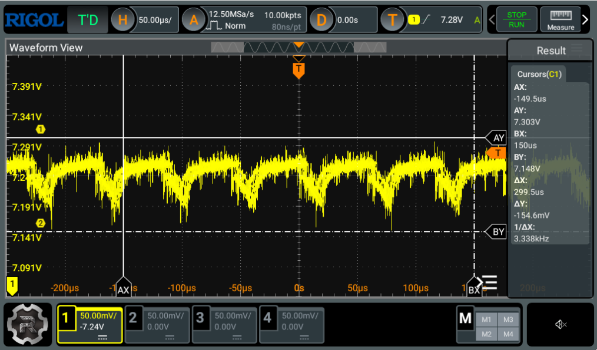
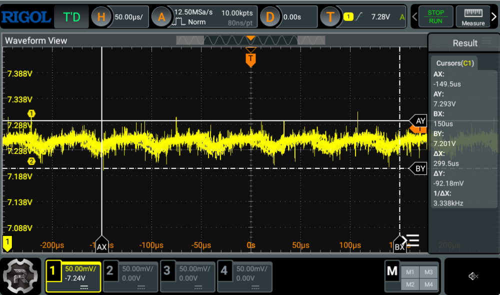

## Nucleo PCB

Simpler PCB for mounting nucleo and motor driver breakout boards.

### Power

- Added a bulk capacitor at the battery connector, to reduce noise from PWM, back EMF, and spikes
in current and voltage from switching direction of motors.

I tested this on the scope having all the motors running at 10% speed, with and without a bulk cap.
The scope was placed on the breadboard power rail on 7.3V+ and GND. The cap was placed on the rail
in parallel.

Without bulk capacitor:

With electrolytic 100 uF bulk capacitor:

